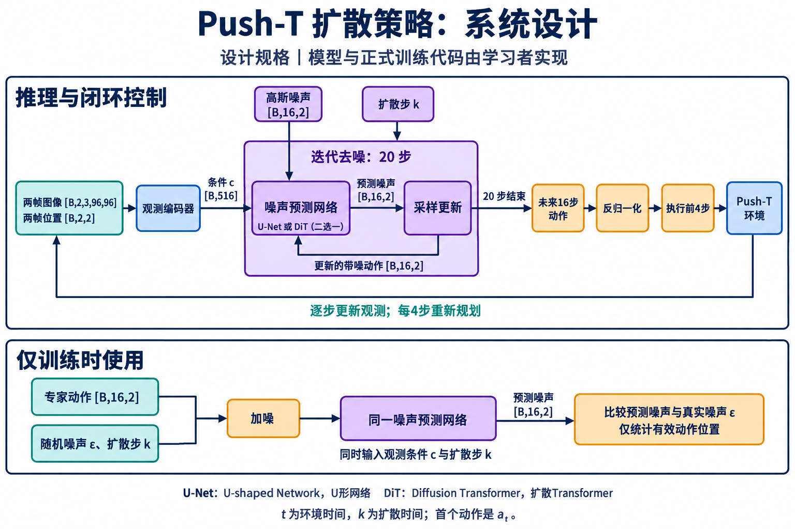
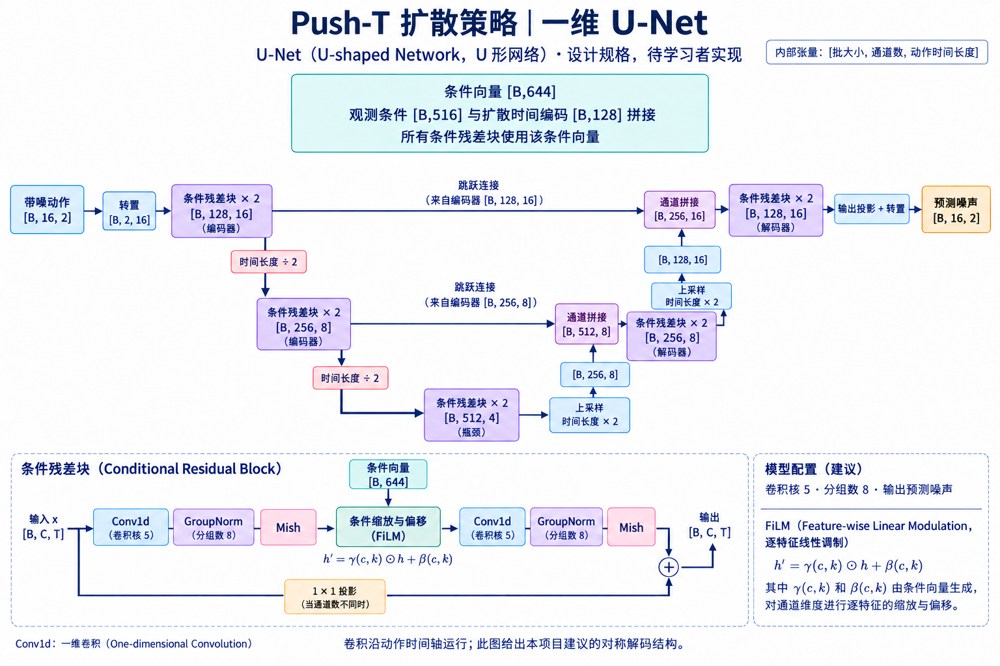

# Push-T Diffusion Policy

基于视觉观测的 Push-T 模仿学习项目：使用条件一维 U-Net 预测动作噪声，通过扩散采样生成动作序列，并在仿真中执行、重新观测和规划。项目覆盖数据审计、模型实现、训练与断点恢复、闭环评测及交互演示。

> **当前状态：开发与训练阶段，尚未完成正式训练和最终评测。** 下方训练结果留空。短训练、恢复检查和工程测试不代表策略已经学会任务，也不代表复现了论文效果。



## 已实现与计划

| 模块 | 当前状态 |
| --- | --- |
| 两帧视觉观测、位置条件、时间步编码、FiLM 条件 U-Net | 已实现 |
| 噪声预测损失、AdamW、学习率调度、EMA | 已实现 |
| 数据审计、尾部掩码、检查点及恢复状态保存 | 已实现 |
| DDIM / DDPM 采样、闭环评测、动作回放、网页交互 | 已接入 |
| Colab L4 预检查与训练脚本 | 已提供；运行需要外部数据与 GPU 环境 |
| 正式训练、开发集选点、最终独立场景评测 | 待完成 |
| DiT 骨干及与 U-Net 的完整比较 | 待实现 / 待验证 |

代码与历史验收记录见 [PROGRESS.md](PROGRESS.md)。其中带日期的旧记录描述当时版本，不能作为当前代码全套测试通过的证明。`docs/` 内的 DiT 图和部分接口文档描述规划，不代表对应模型已经可运行。

## 方法与数据流

```text
两帧 RGB 图像 + 两帧推杆位置
              ↓
ResNet-18 视觉编码 + 位置条件 + 扩散时间步编码
              ↓
条件 1D U-Net：从带噪动作预测噪声
              ↓
DDIM 迭代去噪 → 16 步二维动作 → 执行前 4 步 → 重新观测
```

训练时对专家动作加噪，以有效动作位置上的噪声预测误差训练网络。推理时从随机噪声开始，反复去噪生成动作。动作表示为推杆的二维绝对目标坐标。



此实现采用先上采样、再拼接同时间分辨率跳跃连接的解码器；不声明与官方 Diffusion Policy 实现逐行相同。

### 张量约定

下表省略 batch 维度。训练数据使用全部 206 个演示回合、25,650 帧和 25,444 个有效动作起点；开发及最终评测使用单独的仿真场景。

| 字段 | 形状 | 含义 |
| --- | --- | --- |
| `images` | `[2, 3, 96, 96]` | 两帧 RGB，ImageNet 标准化 |
| `positions` | `[2, 2]` | 两帧推杆位置，min-max 归一化 |
| `actions` | `[16, 2]` | 从当前时刻开始的专家动作序列 |
| `valid_mask` | `[16]` | 仅有效动作参与监督 |

历史不足时重复首帧；窗口不跨回合。尾部重复最后有效动作，并用掩码排除填充监督。归一化统计来自原始记录，避免滑动窗口重复计数。

### 默认实验配置

完整配置见 [configs/unet.json](configs/unet.json)。

| 项目 | 配置 |
| --- | --- |
| 观测 / 预测 / 执行长度 | 2 / 16 / 4 |
| 视觉编码器 | ResNet-18，ImageNet 初始化 |
| 训练扩散日程 | 100 步，余弦日程，预测 epsilon |
| 默认推理 | DDIM，20 步，`eta=0` |
| 计划训练预算 | 40,000 次更新，batch 64，seed 0 |
| 优化器 | AdamW，学习率 `1e-4` |
| 学习率 | 500 步预热，余弦下降 |
| 数值精度 | float32 |
| 检查点 | 每 1,000 步保存 last；每 5,000 步保留候选快照 |

采样使用 `clip_sample=False`、`thresholding=False`；仅在最终反归一化后将物理动作裁剪至 `[0, 512]`。这些是本项目的实验选择，不构成论文数值复现承诺。

## 安装与准备

需要 Python 3.11 或更高版本。以下命令从仓库根目录运行：

```bash
git clone https://github.com/imwaterhuang/pusht-diffusion.git
cd pusht-diffusion
python3 -m venv .venv
source .venv/bin/activate
python -m pip install --upgrade pip
python -m pip install -e '.[test]'
python -m pusht_diffusion --help
```

`pyproject.toml` 固定了 PyTorch / TorchVision 版本；[requirements-verified.txt](requirements-verified.txt) 是历史本机环境记录，不代表所有平台均已完成全新安装验证。Colab 应保留已有 CUDA PyTorch，并使用 [requirements-colab.txt](requirements-colab.txt) 安装辅助依赖，通过 `PYTHONPATH=src` 运行源码。

数据集与模型权重不包含在 Git 仓库中。需要准备与 [数据审计记录](reports/data-audit.json) 匹配的 Push-T 图像数据：`data/**/*.parquet` 包含图像、位置、动作及索引，`meta/episodes/**/*.parquet` 包含回合边界。当前加载器依赖这一具体格式，不能直接替换为任意 Push-T 数据版本。

```bash
export PUSHT_DATA=/absolute/path/to/pusht_image
python -m pusht_diffusion audit \
  --dataset "$PUSHT_DATA" --output runs/local-data-audit.json
```

审计会验证记录数量、回合边界、数据身份与归一化统计。首次模型初始化还需要获取 ImageNet 预训练权重，或事先准备相应缓存。

## 训练与恢复

复制路径模板，并将 `dataset_root` 改为自己的数据路径；`output_dir` 指向训练输出目录，`checkpoint_mirror` 可指定持久化镜像目录。

```bash
cp configs/paths.example.json local.json
# 编辑 local.json 后启动；此命令会真正训练。
python -m pusht_diffusion train \
  --config configs/unet.json --paths local.json --device cuda

# 从完整检查点继续，使用相同的数据与配置。
python -m pusht_diffusion train \
  --config configs/unet.json --paths local.json --device cuda \
  --resume runs/unet/last.pt
```

检查点包括模型、EMA、优化器、学习率状态、已消费批次位置和随机数状态。训练 loss 只用于观察优化过程，模型选择需要后续闭环评测。

Colab 专用入口是 [colab_preflight.py](scripts/colab_preflight.py) 和 [colab_train.py](scripts/colab_train.py)。后者要求 L4、已挂载的 Drive 和与代码、配置及数据对应的预检查报告。

[现有 Colab notebook](notebooks/PushT_Diffusion_UNet_L4_20261007.ipynb) 保留特定日期的压缩包上传流程和 SHA-256 校验；该代码与数据压缩包未随仓库发布。直接 clone 仓库不能替代 notebook 要求的压缩包，使用前需要自行准备对应快照或调整其准备单元格。

## 评测与交互

已有 50 个开发场景；最终 100 个场景尚待模型选择锁定后生成。单回合最多 300 步：主指标为曾达到 `coverage > 0.87`，同时记录 `coverage > 0.95` 与最大覆盖率。主阈值达到后继续执行，直到严格阈值达到、环境终止或步数上限。

下面命令需要自行提供训练后的兼容检查点；仓库不附带训练完成的权重。

```bash
python -m pusht_diffusion eval --model unet \
  --checkpoint runs/unet/selected.pt --audit runs/local-data-audit.json \
  --scenes scenes/development.json --output runs/unet-development.json
python -m pusht_diffusion report runs/unet-development.json \
  --output runs/unet-development-report.json
```

交互页面当前要求加载 ACT 基线，扩散模型可选：

```bash
python -m pusht_diffusion serve \
  --act /absolute/path/to/act.pt --unet /absolute/path/to/unet.pt \
  --audit runs/local-data-audit.json --port 7861
# 浏览器访问 http://127.0.0.1:7861/live
```

页面支持暂停、继续、同场景重放、换场景及物体干预。交互调试不写入正式评测成绩。ACT 使用单帧观测和自身归一化约定，与两帧扩散策略的差异不能全部归因于模型骨干。

## 训练结果

**待正式训练、检查点选择及独立闭环评测完成后补充；所有数值暂留空。**

| 模型 | 检查点 / 训练步数 | 成功率（> 0.87） | 严格成功率（> 0.95） | 平均最大覆盖率 | 推理耗时 |
| --- | --- | --- | --- | --- | --- |
| Diffusion Policy · U-Net | | | | | |
| Diffusion Policy · DiT（计划） | | | | | |
| ACT（同协议基线） | | | | | |

训练曲线、成功与失败视频、跨种子统计和对比结论均待补充。`reports/` 中现有短闭环、预检查及历史测试文件仅用于工程追溯，不填入上表。

## 代码导航

| 路径 | 职责 |
| --- | --- |
| `src/pusht_diffusion/learner/models.py` | 视觉编码与条件 U-Net |
| `src/pusht_diffusion/learner/training.py` | 损失、参数更新、EMA 与训练循环 |
| `src/pusht_diffusion/data.py` | 数据审计、窗口与图像读取 |
| `src/pusht_diffusion/policies.py` | 策略适配与扩散采样 |
| `src/pusht_diffusion/checkpoints.py` | 检查点保存与读取 |
| `src/pusht_diffusion/evaluation.py` | 闭环轨迹、统计与报告 |
| `src/pusht_diffusion/live.py` | 本地交互服务 |
| `configs/` · `scenes/` | 实验配置与场景协议 |
| `scripts/` · `tests/` | 验证工具与工程测试 |

历史测试中有依赖旧模型接口的用例，当前全套测试尚未完成适配；历史通过数量不代表此版本全套通过。模型与训练核心由学习者实现，本仓库保留当前工作进度。

## 来源

ACT 基线及部分工程模块来自 [Mini-WAM](https://github.com/imwaterhuang/mini-wam)，具体文件与来源哈希见 [provenance.json](docs/provenance.json)；独立 ACT 项目见 [act-pusht](https://github.com/imwaterhuang/act-pusht)。本项目是学习与实验实现，未宣称与原论文相同配置或达到原论文结果。
