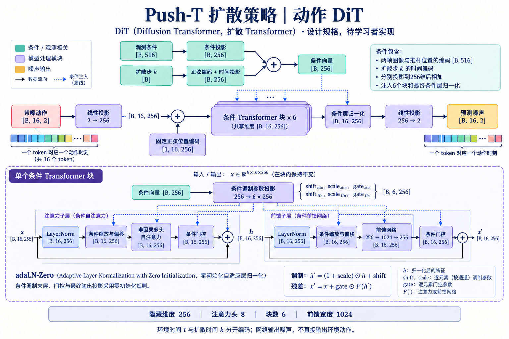

# Push-T 扩散策略架构与张量契约

这些图片是**设计规格**，由内置 imagegen 工具生成并逐张核查。模型、训练损失和正式训练循环由学习者实现；图中结构不代表已经实现或训练成功。学习者负责的代码位于 `src/pusht_diffusion/learner/`，具体入口以 [学习指南](learning.md) 为准。

生成方式、原始提示词及修订提示词保存在 [architecture-prompts.md](architecture-prompts.md)，最终原始图片的校验值和来源在 [资源清单](assets/architecture-manifest.json)。最终图片没有用代码修改像素。

## 系统总览

`B` 是批大小；`t` 是环境时间；`k` 是扩散步；动作块中的相对位置用 `j=0,…,15` 表示。动作位置编码和扩散时间编码是两种不同的信息。

| 边界 | 张量/含义 |
|---|---|
| 原始观测 | 两帧图像与对应推杆二维位置 |
| 模型图像输入 | `[B,2,3,96,96]`，ImageNet 标准化 |
| 模型位置输入 | `[B,2,2]`，按训练原始记录的最小值/最大值归一化 |
| 视觉骨干 | 每帧 ResNet-18（Residual Network，残差网络）空间特征 `[B,512,3,3]`，两帧使用同一骨干 |
| 每帧投影 | 展平空间网格后投影到 256 维；建议线性投影、层归一化、SiLU（Sigmoid Linear Unit，Sigmoid 线性单元） |
| 观测条件 | 每帧视觉256维与位置2维拼接，再按前一帧、当前帧顺序展平：`[B,516]` |
| 去噪网络 | 带噪动作 `[B,16,2]`、扩散步 `[B]`、条件 `[B,516]` → 预测噪声 `[B,16,2]` |
| 策略输出 | 采样后反归一化的16个二维绝对目标坐标；执行前4个 |

同一个模型内部，两帧共享视觉编码器；不同骨干实验使用相同结构和初始权重，但分别训练，不共享已经训练过的编码器。视觉骨干参与训练，批归一化运行统计保持固定；这部分由学习者实现。

推理从高斯噪声开始，每轮先预测噪声，再由采样器更新带噪动作。观测条件在一次重新规划时计算一次，在该次全部去噪步骤间复用。网络输出的是噪声；完成采样后得到的才是动作。

默认采用 DDIM（Denoising Diffusion Implicit Models，去噪扩散隐式模型）20步、`eta=0`；初始噪声仍由明确的场景/规划序号控制。DDPM（Denoising Diffusion Probabilistic Model，去噪扩散概率模型）100步用于诊断。工程封装的采样裁剪配置以冻结配置为准；环境目标最终限制在合法坐标范围。

训练输入中的专家动作只有训练时可见：`a_t,…,a_(t+15)` 加噪后送入网络，真实加入的噪声作为监督目标。尾部填充不参加损失。图中训练面板省略了损失目标的独立箭头，用文字指出其与真实噪声的比较；没有省略观测条件或扩散步。

环境中每执行一步都更新历史。重规划时总是读取最近两帧。回合首帧和拖动后的历史由当前观测重复补齐；拖动、重置和模型切换必须清空尚未执行的动作。

## 一维 U-Net

U-Net（U-shaped Network，U形网络）沿动作**时间长度**进行卷积，不是在图像高宽上运行。外部接口是 `[B,16,2]`，内部卷积使用 `[B,C,H]`，其中 `C` 是通道数、`H` 是动作序列长度。

### 条件路径

观测条件 `[B,516]` 与由 `k` 产生的128维时间表示**独立计算后拼接**，形成 `[B,644]`。观测条件不输入扩散时间编码器。所有条件残差阶段使用这一条件向量。

FiLM（Feature-wise Linear Modulation，逐特征线性调制）根据条件产生逐通道缩放和偏移，并在时间轴广播。残差块内部包含两次卷积/分组归一化/激活；条件调制置于第一次处理之后，块输出与输入的残差支路相加。输入输出通道不同时，残差支路使用1×1投影。图中残差小图的 `C` 为通道占位符，不要求 `C_in=C_out`。

### 主路径与跳跃连接

| 顺序 | 输出形状 | 说明 |
|---|---|---|
| 转置 | `[B,2,16]` | 进入一维卷积布局 |
| 编码阶段1 | `[B,128,16]` | 两个条件残差块；保存跳跃特征 |
| 下采样、编码阶段2 | `[B,256,8]` | 长度减半；两个条件残差块；保存跳跃特征 |
| 下采样、瓶颈 | `[B,512,4]` | 长度再次减半；两个条件残差块 |
| 上采样 | `[B,256,8]` | 长度恢复为8，通道调整为256 |
| 拼接阶段2跳跃特征 | `[B,512,8]` | `256+256`；两个输入时间长度都为8 |
| 解码阶段2 | `[B,256,8]` | 两个条件残差块，不得从拼接直接跳过该阶段 |
| 上采样 | `[B,128,16]` | 长度恢复为16，通道调整为128 |
| 拼接阶段1跳跃特征 | `[B,256,16]` | `128+128`；两个输入时间长度都为16 |
| 解码阶段1 | `[B,128,16]` | 两个条件残差块 |
| 输出投影、转置 | `[B,16,2]` | 预测加入的噪声 |

残差块卷积核为5、保持长度的填充为2、分组归一化组数为8。建议下采样采用核4、步长2、填充1的一维卷积，上采样采用对应的转置卷积；输出采用逐时刻通道投影。时间编码使用固定正弦编码和可学习投影。

本图采用**先上采样、再与同分辨率特征拼接、再经过残差块**的对称解码设计。它与[官方 ConditionalUnet1D](https://github.com/real-stanford/diffusion_policy/blob/main/diffusion_policy/model/diffusion/conditional_unet1d.py)的具体解码顺序不完全相同；本项目不是官方实现的逐行复现。跳跃拼接也不同于残差块内部的逐元素相加。

## 动作 DiT

DiT（Diffusion Transformer，扩散 Transformer）把每个动作时刻作为一个 token（表示向量）。它处理16个动作表示向量，不把图像切成块交给去噪 Transformer，也不加载图像 DiT 权重。

| 步骤 | 形状/设置 |
|---|---|
| 动作投影 | `[B,16,2]` → `[B,16,256]` |
| 动作位置 | 加固定正弦编码 `[1,16,256]`，位置是块内 `j=0,…,15` |
| 条件 | 观测条件516维与扩散时间表示分别投影到256维后相加 |
| 条件块 | 6层，8个注意力头；前馈网络 `256→1024→256` |
| 注意力 | 非因果；一个待去噪动作可读取同一动作块其他位置 |
| 输出 | 条件层归一化，再从256投影到2：`[B,16,2]` 噪声 |

每个块包含自注意力和前馈网络两条残差支路。adaLN-Zero（Adaptive Layer Normalization with Zero Initialization，零初始化自适应层归一化）根据条件向量生成两组 `shift、scale、gate`：分别控制归一化后特征的偏移/缩放及残差支路门控。调制为 `(1+scale)*h+shift`，门控残差为 `x+gate*F(h')`。

图中蓝色虚线概括条件分配；实际条件投影的六组参数分别送往两个调制操作与两个门控操作，不额外拼接动作序列，也不把条件直接当作注意力的另一个输入 token。条件投影输出可以视作 `[B,6,256]` 再拆分。

按照[原始 DiT 的初始化原则](https://github.com/facebookresearch/DiT/blob/main/models.py)，每块条件调制末层和最终输出投影零初始化，最终条件层归一化的调制末层也零初始化；前面的时间/观测投影不是全部置零。初始化后的某些上游梯度在首次更新时为零是预期行为，不能用“第一次每层都必须有非零梯度”作为通过标准。

图中 `t` 表示环境时间，动作正弦位置编码实际使用块内相对位置 `j`；`k` 是独立的扩散步。没有任务文字、类别标签或额外机械臂状态输入。

## 使用这些图学习

1. 先拿一个窗口指出两帧来自哪两个时刻、动作从哪一行开始。
2. 只实现观测编码器并核对516维的构成。
3. 再实现时间编码、条件残差块和U-Net，逐段检查长度和通道。
4. 核对加噪和预测噪声的含义，再由你实现损失与训练更新。
5. U-Net链路明确后，用相同接口实现DiT；保持数据与推理采样设置一致。

本次交付不包含上述模型算法或正式训练算法的可运行答案。已有ACT（Action Chunking with Transformers，基于Transformer的动作分块）仅用于验证外围系统和演示。
