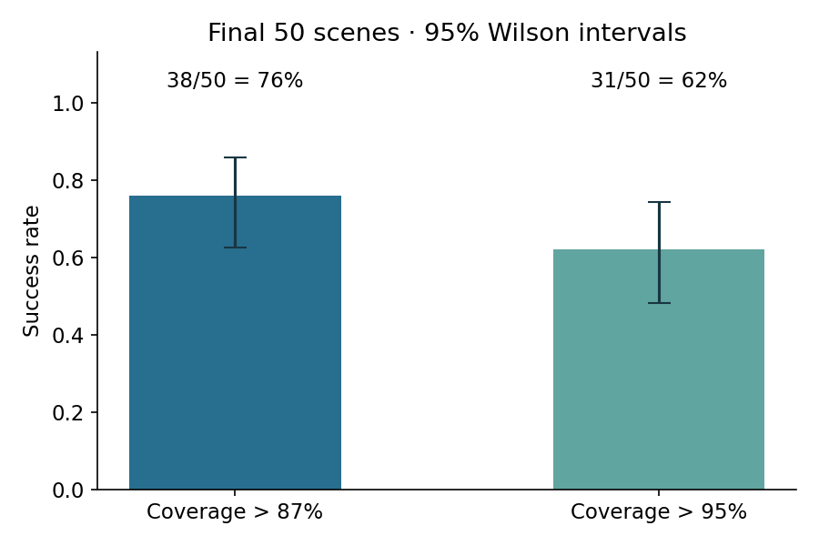
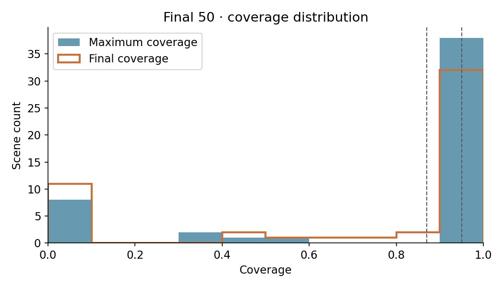
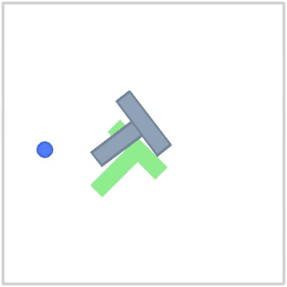
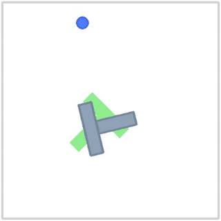
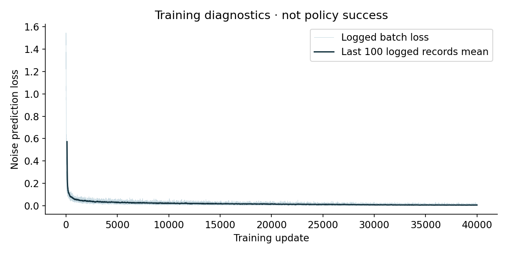

# Push-T Diffusion Policy 最终验收

已核验最终 **50/50** 个冻结场景。采用开发集选出的 **step 40000 EMA** 权重。

| 指标 | 成功数 / 场景数 | 成功率 | Wilson 95% 区间 |
|---|---:|---:|---:|
| 最大覆盖率 >87% | 38/50 | 76.0% | 62.6%–85.7% |
| 最大覆盖率 >95% | 31/50 | 62.0% | 48.2%–74.1% |

平均最大覆盖率：**76.09%**；平均终态覆盖率：**70.23%**。
规划延迟 p50 / p95：181.6 / 189.4 ms。
初始状态已 >87%：0/50；初始已 >95%：0/50。

## 协议与选模

U-Net；EMA；DDIM 20 步；每次预测 16 个动作、执行前 4 个；相邻两帧观测逐环境步更新；最多 300 步。
先在相同的 50 个开发场景比较 5k–40k 共 8 个快照，按 >87% 成功数、平均最大覆盖率、较早训练步数依次选模。
最终评测按用户要求采用独立 50 场景，使用显式 v2 协议修订；不将原 v1 的 100 场景要求伪称为已满足。

| 步数 | >87% 成功数 | >95% 成功数 | 平均最大覆盖率 |
|---|---:|---:|---:|
| 5000 | 27/50 | 9/50 | 72.66% |
| 10000 | 43/50 | 21/50 | 86.03% |
| 15000 | 40/50 | 24/50 | 81.56% |
| 20000 | 42/50 | 26/50 | 83.03% |
| 25000 | 39/50 | 23/50 | 82.28% |
| 30000 | 40/50 | 21/50 | 81.02% |
| 35000 | 42/50 | 28/50 | 86.11% |
| 40000 | 43/50 | 28/50 | 86.39% |

10k 与 40k 的主指标同为43/50；40k 平均最大覆盖率更高，因此按预定规则入选。这不构成两者差异显著的证据。开发阶段8进程共享GPU，其延迟不用于最终单进程性能报告。

检查点 SHA256：`6d8e1fcb0342f377e6973be82139b63302feef64f0cf037f6db9b75da13873b4`。
最终场景 SHA256：`631acfdc20d360463e989b607e391b9b636a7c899cd5fba5bb3d6ad46da3a613`。

## 结果解读

50场中，31场达到严格阈值，7场仅达到87%阈值，12场未达到87%。所有场景初始覆盖率均未超过87%，成功并非来自初始即完成。若改用终态覆盖率，>87% 为33/50，>95% 为31/50；这与按轨迹最大覆盖率统计是不同指标。

本次已完成训练、选模、最终评测和证据回放的工程验收。没有事先约定性能合格线，因此不将76%或62%表述为达到预设性能门槛。

## 固定规则回放视频

最小 scene_id 的 >95% 成功场景：`diffusion-final50-000`。[完整视频](https://github.com/imwaterhuang/pusht-diffusion/releases/download/unet-l4-final50-20261007/success.mp4)；回放最大 coverage 误差 0。

最小 scene_id 的 >87% 失败场景：`diffusion-final50-017`。[完整视频](https://github.com/imwaterhuang/pusht-diffusion/releases/download/unet-l4-final50-20261007/failure.mp4)；回放最大 coverage 误差 2.22e-16。

[全部 50 场固定顺序视频](https://github.com/imwaterhuang/pusht-diffusion/releases/download/unet-l4-final50-20261007/all50.mp4)：5 页，每页 10 场；150.5 秒；逐步回放最大 coverage 误差 5.55e-16。

## 训练诊断

曲线来自日志中已舍入的 loss，仅作训练诊断。

## 限制

- 全部 206 条演示用于训练；仅一个训练随机种子（seed=0），没有跨训练种子稳定性证据。
- 最终场景在开发集选模锁定后独立随机生成，并排除记录在案的开发/debug种子及初始状态；无法证明与训练姿态完全不重合。
- Wilson 95% 区间反映这 50 个场景的抽样不确定性；不是未来成功率保证，也不是跨训练种子的误差条。
- 两项成功均按整条轨迹（包括初始状态）的最大 coverage 严格大于阈值计算；不是终态覆盖率成功率。
- 达到 >95% 或环境终止则提前结束，否则执行最多 300 步；达到 >87% 后仍继续运行。
- loss 只作为噪声预测训练诊断，不能据此断言闭环策略成功；本报告结论来自最终闭环 trace。
- 两个示例视频按预声明规则选取，只用于展示；另提供包含全部 50 场的固定顺序拼接视频，短轨迹结束后停帧标记。
- 该报告核验冻结选模记录中的排序和哈希关联；未重新运行开发评测或训练。

## 原始证据

[逐场 CSV](per-scene.csv) · [结构化报告](acceptance.json) · [原始结果](evidence/results.json) · [冻结场景](evidence/scenes.json) · [选模锁](evidence/selection.json) · [运行清单](evidence/manifest.json)
